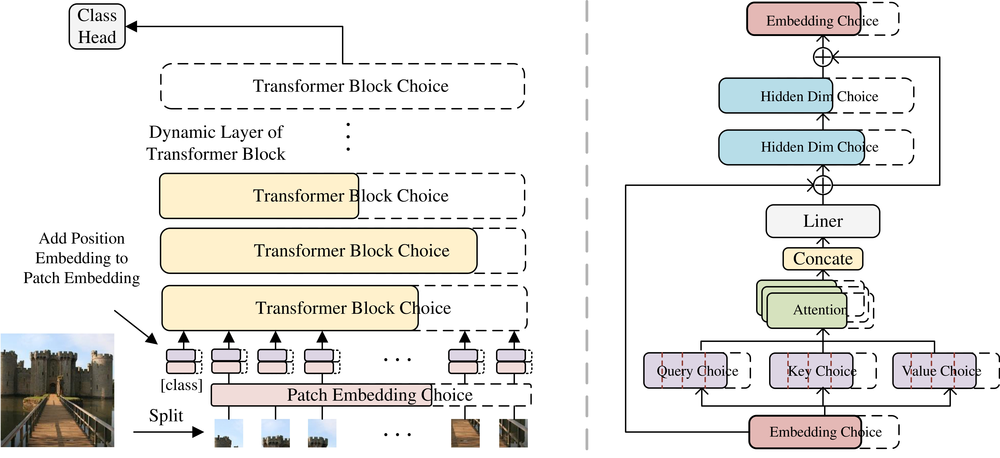
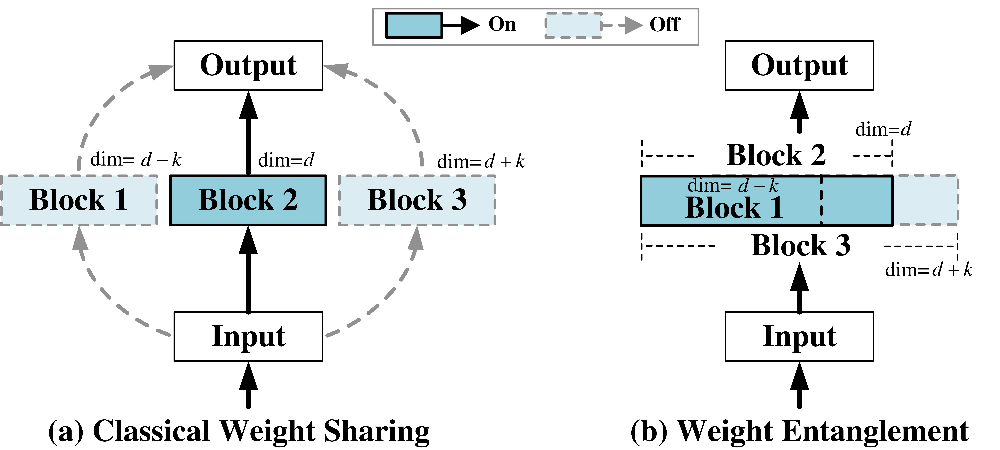

# Searching in AutoFormer model space

In this tutorial, we demonstrate how to define, train and search the model space proposed in the [AutoFormer: Searching Transformers for Visual Recognition](https://arxiv.org/abs/2107.00651).

Through this process, you will learn:
- How to define a model space compatible with RandomOneShot strategy.
- How to use the built-in model spaces from NNI model space hub.
- How to use RandomOneShot strategy to train a model space.
- How to customize evaluators to achieve the best performance.

## Define a model space
The model space proposed in [AutoFormer](https://arxiv.org/abs/2107.00651) originated from [ViT](https://arxiv.org/abs/2010.11929), where the full model is constructed by repeatedly stacking Transformer Blocks. Each transformer block consists of a multi-head self-attention (MHA) layer, a feed-forward network (FFN) layer, and several residual connections. The AutoFormer model space has 4 variable factors : `embed_dim`, `depth`, `num_heads`, `mlp_ratio`. The first two are global configurations, and the last two is layer-wise configurations.
| Model | `embed_dim`   |  `depth`   | `num_heads` |  `mlp_ratio`  |
|-------|---------------|------------|-------------|---------------|
| Tiny  | 192, 216, 240 | 12, 13, 14 |   3, 4      | 3.0, 3.5, 4.0 |
| Small | 320, 384, 448 | 12, 13, 14 |   5, 6, 7   | 3.0, 3.5, 4.0 |
| Base  | 528, 576, 624 | 14, 15, 16 |   8, 9, 10  | 3.0, 3.5, 4.0 |



In [Single Path One-Shot](https://arxiv.org/abs/1904.00420), the weight are shared between different layers, however, the weights of candidate blocks in the same layer are decoupled. The Autoformer use another one-shot method called weight-entanglement, which enable different blocks in the same layer to share weights for their common parts. 


In NNI, the model space is an abstract logical space that can combine different strategies, and the update of weights in the model space is determined by specific strategy. The weight-entanglement used in autoformer is implemented by the `RandomOneShot` strategy. 

### How RandomOneShot strategy work in NNI
Different form SPOS, the common part in weight-entanglement need to be carefully defined. To realize the common parts sharing in weight-entanglement, the `RandomOneShot` strategy will invoke `traverse_and_mutate_submodules` to convert `nn.Module` with mutator into the corresponding `MixedOperation`, which defines the weight selection and the forward propagation process.

For example, when there is a `nn.Linear` layer with `nn.ValueChoice` mutator in the model space. The shape of `weight` in `MixedLinear` is `(24, 3)`, i.e. the maximum weight of the module. When `embed_dim` is resampled to 16, the prefix of `weight` will be sliced as the weight of the subnet, the current shape of `weight` is `(16, 3)`. 

NNI has already pre-defined `MixedOperation` of five commonly used module: `Linear`, `Conv2d`, `BatchNorm2d`, `LayerNorm`, `MultiHeadAttention`.

```python
@model_wrapper
class ModelSpace(nn.Module):
    def __init__(self, ...):
        ...
        self.fc = nn.Linear(3, nn.ValueChoice([8, 16, 24], label="embed_dim"))
    
    def forward(self, x):
        ...
        x = self.fc(x)
        return x
```

### Customize mixed operation
In general, the basic operations provided by NNI are sufficient for most scenarios. However, you can also customize mixedOperation as needed. 

The customization process consists of two main parts: define a torch-style `nn.Module` and corresponding `MixedOperation`.

The following example shows how to convert an absolute position embedding module commonly used in Transformer into a one-shot compatible mixedOperation.

Firstly, you need to define the module when the parameters are immutable and wrap it with the `basic_unit` decorator. In this example, we define an `AbsPosEmbed` module inherits from `nn.Module`. The code is basically the same as PyTorch, except for the addition of a 'basic_unit' decorator. When define model space, you will use this module class.
```python
@basic_unit
class AbsPosEmbed(nn.Module):
    """ Add absolute position embedding on patch embedding.
    """
    def __init__(self, length: int, embed_dim: int):
        super().__init__()
        self.pos_embed = nn.Parameter(torch.zeros(1, length, embed_dim))
        trunc_normal_(self.pos_embed, std=.02)

    def forward(self, x):
        return x + self.pos_embed

@model_wrapper
class ModelSpace(nn.Module):
    def __init__(self, ...):
        ...
        self.abs_embed = AbsPosEmbed(14*14+1, nn.ValueChoice([192, 216, 240], label="embed_dim"))
    
```
Secondly, you need to define the corresponding `MixedOperation` of the previous module. This `MixedOperation` inherits from `MixedOperation` and the previous module `AbsPosEmbed`. You must specify the module bound to the mixed operation by `bound_type` and limit the arguments that supports mutator through `argument_list`.
You also must overwrite three class method: `super_init_argument`, `slice_param`, `forward_with_args`. The `super_init_argument` will determine the maximum parameter that the Module needs to initialize based on the variable arguments. The `slice_param` will select the desired parameter from the largest parameter. The `forward_with_args` will determine the forward process. It will invoke `slice_param` method .


```python
class MixedAbsPosEmbed(MixedOperation, AbsPosEmbed):
    """ Mixed absolute position embedding add operation.

    Supported arguments are:

    - ``embed_dim``

    Prefix of pos_embed will be sliced.
    """
    bound_type = AbsPosEmbed
    argument_list = ['embed_dim']

    def super_init_argument(self, name: str, value_choice: ValueChoiceX):
        return max(traverse_all_options(value_choice))

    def slice_param(self, embed_dim, **kwargs) -> Any:
        embed_dim_ = _W(embed_dim)
        pos_embed = _S(self.pos_embed)[..., :embed_dim_]

        return {'pos_embed': pos_embed}

    def forward_with_args(self,  embed_dim,
                        inputs: torch.Tensor) -> torch.Tensor:
        pos_embed = self.slice_param(embed_dim)['pos_embed']
        assert isinstance(pos_embed, torch.Tensor)

        return inputs + pos_embed
```

### Fix a subnet from model space
After defining a model space, you may also want to get the subnet based on a given architure dict. This can be relized through `FixedFactory`.

```python
from nni.nas.hub.pytorch.utils.fixed import FixedFactory
model_factory = FixedFactory(cls, arch)
model = model_factory(**init_kwargs)
```
Also, the `AutoformerSpace` provided in hub has a class method `AutoformerSpace.load_searched_model(...)` which will return the pre-searched subnet. 

| Size  |        name        | Params. | Acc@Top-1 | Acc@Top-5 |
|-------|--------------------|---------|-----------|-----------|
| Tiny  | `autoformer-tiny`  |   5.8M  |  75.31    |   92.69   |
| Small | `autoformer-small` |  22.9M  |  81.67    |   95.72   |
| Base  | `autoformer-base`  |  53.7M  |  82.39    |   95.74   |

## Obtain the weights of subnet from model space
After trained a model space with `RandomOneShot` Strategy, you may want to evaulate on the subnet sampled from model space. The search strategy like `Random`, `RegularizedEvolution` will feed the subnet to execute engine and evaluate multiple subnets simultaneously based on the amount of computing resources. 
You only need to define a subnet `Evaluator`. In this example, the function `evaluate_acc` are wraped in `Evaluator` by `FunctionalEvaluator` to calcuate the classification accuracy of subnet. This function receive one single model class and other keyword arguments specified in `FunctionalEvaluator`. The `Evaluator` will instantiate the subnet model class with default weights, so before evaulate the subnet, you need to load the weights of the subnet at first. 
The `sub_state_dict(arch)` interface of `RandomOneShot` exports the corresponding subnet state_dict from the model space based on the given architecture dictionary. 
The `AutoformerSpace` also provide a interface `load_strategy_checkpoint(name)` to get the `RandomOneShot` strategy with well-trained supernet weights. 

```python
@torch.no_grad()
def evaluate_acc(class_cls, args):
    strategy = AutoformerSpace.load_strategy_checkpoint(f'random-one-shot-{args.name}')
    strategy.model.load_state_dict(super_state_dict)
    # get the arch dict of the current sub-model
    arch = nni.get_current_parameter()['mutation_summary']
    # slice supernet params to subnet
    state_dict = strategy.sub_state_dict(arch)
    model = class_cls()
    # load subnet state dict
    model.load_state_dict(state_dict)
    model.cuda().eval()

    dataset = Dataset(...)
    dataloader = DataLoader(dataset, ...)

    # calcuate metric of the subnet on dataset
    for it, (inputs, targets) in enumerate(dataloader):
        inputs, targets = inputs.cuda(), targets.cuda()
        metric = evaluate(model(inputs), targets)
        nni.report_intermediate_result(metric)

    # report final metric of subnet
    nni.report_final_result(metric)

model_space = AutoformerSpace(...)
evaluator = FunctionalEvaluator(evaluate_acc, args=args)
evolution_strategy = RegularizedEvolution(...)

exp = RetiariiExperiment(model_space, evaluator, strategy=evolution_strategy)

exp_config = RetiariiExeConfig('local')
exp.run(exp_config, args.port)
```


## Train the model space
Training from scratch or finetuning share the same way except for some hyper-parameters. You can use the evaluator `Classification` provided in `nni.nas.evaluator.pytorch.lightning` directly. 

```python

dataset = Dataset(...)
dataloader = DataLoader(dataset, ...)

# define an evaluator
evaluator = Classification(...)
# define the model space
model_space = AutoformerSpace(...)
# define the training strategy
strategy = RandomOneShot(mutation_hooks=model_space.get_extra_mutation_hooks())

# warp model_space, evaluator, strategy
exp = RetiariiExperiment(model_space, evaluator, [], strategy)
# define experiment config
exp_config = RetiariiExeConfig('local')
exp_config.experiment_name = 'ImageNet train scratch'
exp_config.execution_engine = 'oneshot'

# launch experiment
exp.run(exp_config, args.port)
```

However, this build-in evaluator has limited functionality. To replicate the training process in the paper, you need to customize a evaluator to support operations such as data augmentation and learning rate scheduling. The evaluator is in fact a `pytorch_lighting` style `LightingModule`. The following code snippet shows how to define a evaluator that supports pre-trained weights loading, data augmentation, and learning rate scheduling. Please refer to `lighting.py` for more details.

```python
@nni.trace
class _SupervisedLearningModule(LightningModule):
    trainer: pl.Trainer
    def __init__(self, ...):
        super().__init__()
        self.criterion = criterion
        self.optimizer = optimizer
        self.scheduler = scheduler
        self.mixup_fn = mixup
        self.weights = weights

    def forward(self, x):
        return self.model(x)

    def training_step(self, batch, batch_idx):
        x, y = batch
        if self.mixup_fn is not None:
            x, y = self.mixup_fn(x, y)
        y_hat = self(x)
        loss = self.criterion(y_hat, y)
        ...
        return loss

    def configure_optimizers(self):
        return {
            "optimizer": self.optimizer(...),
            "lr_scheduler": {
                "scheduler": self.scheduler(...),
                "interval": "epoch",
                "frequency": 1
            },
        }

    def on_fit_start(self):
        if self.weights is not None:
            self.model.load_state_dict(self.weights)

class Classification(Lightning):
    def __init__(self, criterion, optimizer, scheduler, mixup, 
        learning_rate, weight_decay, warmup,
        train_dataloaders, val_dataloaders, 
        **trainer_kwargs
    ):
        module = _SupervisedLearningModule(...)
        super().__init__(module, Trainer(**trainer_kwargs), train_dataloaders=train_dataloaders, val_dataloaders=val_dataloaders)

```